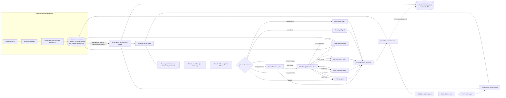

```mermaid
flowchart LR
  Mongo[(🍃 MongoDB: conversations and camera observations)]
  Redis[(🔴 Redis: recent-context cache with TTL)]

  subgraph CameraPipeline[Background camera pipeline]
    Cam[Cameras / NVR] --> Worker[Ingestion workers]
    Worker --> Vision[Vision detection and state estimation]
    Vision --> Mongo
  end

  User[Authenticated user] --> API[POST /cctv-agent]
  API --> Auth[Authenticate and authorize]
  Auth --> Context[Load recent conversation context]
  Redis <--> Context
  Mongo -. cache miss: durable conversation history .-> Context
  Auth --> State[Initialize request state]
  Context --> State
  State --> Guard[Input guardrails inspect input and update state]
  Guard --> Classifier[Classifier LLM: output intent only]

  Classifier --> Crew[CrewAI stateful agentic Flow]
  Crew --> Switch{Agent router service}

  Switch -->|front_entrance| Front[Front Entrance Agent]
  Switch -->|parking| Parking[Parking Agent]
  Switch -->|back_entrance| Back[Back Entrance Agent]
  Switch -->|common_lawn| Lawn[Common Lawn Agent]
  Switch -->|greetings| Greetings[Greetings Agent]
  Switch -->|intent_clarify| Clarify[Clarification Agent]

  Front --> Tools[Intent-scoped camera tools]
  Parking --> Tools
  Back --> Tools
  Lawn --> Tools
  Tools --> ObservationService[Observation service]
  ObservationService --> Mongo
  Mongo --> ObservationService
  ObservationService -->|tailored JSON| Tools
  Tools -->|tool result| Front
  Tools -->|tool result| Parking
  Tools -->|tool result| Back
  Tools -->|tool result| Lawn

  Front --> Answer[Grounded agent response]
  Parking --> Answer
  Back --> Answer
  Lawn --> Answer
  Greetings --> Answer
  Clarify --> Answer
  Answer --> Persist[Persist conversation turn]
  Persist --> Mongo
  Persist -. refresh recent context .-> Redis
  Persist --> Response[Validated API response]
  Response --> User
```
